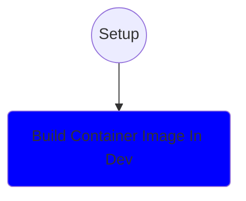

# ChessBuddy project
<i>Per Digre - personal project to explore new tech.</i>

Play at: [https://chessbuddy.net/](https://chessbuddy.net/)

  
Expand

Also an iPad app that follows along when playing chess with my friends.

- chess clock
- logs games
- StockFish and Lozza chessbots opponents
- Names of openings 
- Suggest moves
- Evaluates CP score throughout the game
  

## User guide

  
Expand

This has been used as an assistant like chess clock during friendly two player games. It helps learning.

- It marks board with openings it knows.
- It marks board with what Stockfish would have done.
- It remembers games and scores.
- Keeps track of time, but it does not use it for any other purpose than information
- You can tilt board 90 degress sideways for easy use in a chess clock position alongside the board.
- You can alternative play against Stockfish or Lozza chess engines

## Tech exploration

  
Expand

### 1. React version
My first learning experience
- React
- Typescript
- Chessboard.jsx
- Chess.js
- MobX
- Material-UI
- Tailwind-CSS
- WASM - Stockfish
- PWA
- Playing media
- GCP - Google Cloud Run
- Multi-stage docker
- RUST web-server
- Docker distro-less deployment

### 2. Web-Components version
My second learning trip
- Web Components
- Bun
- Zig
- Chessboard - Web Component 
- Material Design 3 - Web
- MobX for Lit Element
- Structure project for both React and WC

### 3. Future plans
Some of this is not yet production ready and I lack experience.
- Connect Bluetooth chessboard
- Store games in Google cloud
- Use new multi-threaded AI version of Stockfish WASM

## Installation

  
Expand

Installation:
1. == need npm and bun ==
2. react:> npm install
3. react:> bun install
4. react:> bun dev
5. wc> npm install
6. wc:> bun install
7. wc:> bun dev
8. common:> npm install
9. common:> bun install

## Developer

  
Expand

[Development here](doc/dev.md)

Notes:
1. May need to uninstall esbuild and use npm install esbuild

- configuration
- gameplay

## Credits and resources

  
Expand

Credits:
- [https://eddmann.com/posts/creating-a-react-based-chess-game-with-wasm-bots-in-typescript/](https://eddmann.com/posts/creating-a-react-based-chess-game-with-wasm-bots-in-typescript/)

Resources
- Learn Web components with MobX - https://www.npmjs.com/package/@adobe/lit-mobx
- Using Material Design MD-3 for web components - https://m3.material.io/develop/web
- Material Design on Github - https://github.com/material-components/material-web/tree/main/docs/components
- Chessboard - https://github.com/justinfagnani/chessboard-element
- Example pages WC - https://github.com/klyngen/webcomponents-examples

