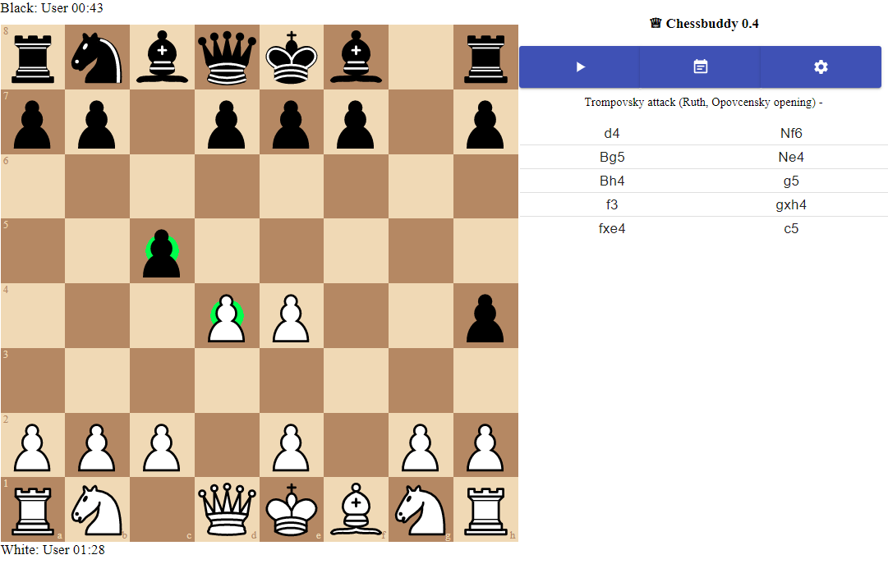

# ChessBuddy

[Development here](doc/dev.md)

_React-based Chess (with multiple Bots) in TypeScript_.

This has been used as an assistant like chess clock during friendly two player games. It helps learning.

- It marks board with openings it knows.
- It marks board with what Stockfish would have done.
- It remembers games and scores.
- Keeps track of time, but it does not use it for any other purpose than information
- You can tilt board 90 degress sideways for easy use in a chess clock position alongside the board.
- You can alternative play against Stockfish or Lozza chess engines

Tech:
- MobX
- TailwindCSS
- Material UI

Demo: [https://chessbuddy.net/](https://chessbuddy.net/) 

Credits to:
[https://eddmann.com/posts/creating-a-react-based-chess-game-with-wasm-bots-in-typescript/](https://eddmann.com/posts/creating-a-react-based-chess-game-with-wasm-bots-in-typescript/)
