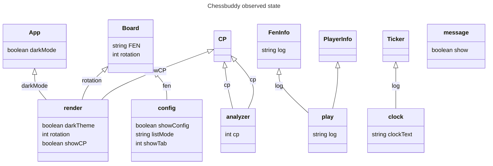
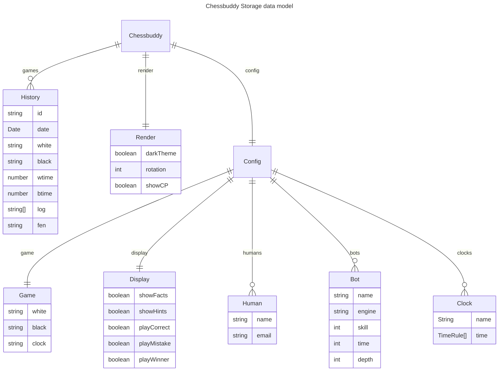

# Code Chessbuddy

## MOBX Observables
* Config - orientation, settings
* Rendering - screensize
* Players - list of bots and players
* GameState - playing or paused
* Game - the game updates when move is done
* GameHistory - previous games updates when game completes
* Server - online game history storage
* Helper - gets CP and Stockfish suggestions
* TimeKeeper - updates timer every second of play
* RefreshTimer - 100ms refresh, due to ChessBoard bug
* Messages- Message box, prompts

